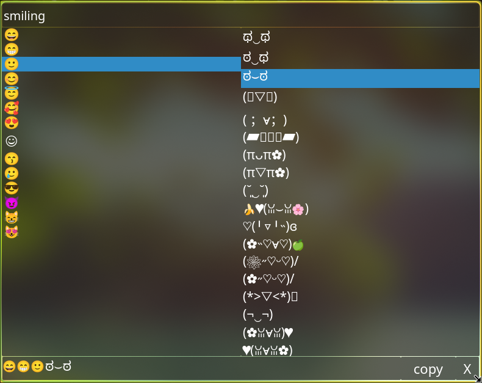
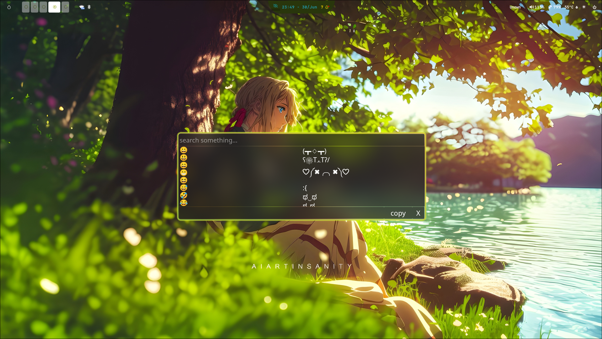

<p align="center">
  
</p>

<h1 align="center">Unown</h1>

<p align="center">
  A fast, lightweight emoji & kaomoji picker for Linux, built with <b>PySide6</b>.
  <br>
  Inspired by <b>RofiEmoji</b>, with powerful search and multi-item clipboard support.
</p>

---

## ✨ Features

- 😀 Browse thousands of emojis and kaomojis.
- 🔍 Instant search by tags.
- 📋 Accumulate multiple emojis/kaomojis before copying.
- ⚡ Lightweight PySide6 desktop application.
- 🎨 Modern interface.
- 🐧 Designed as a feature-rich alternative to **RofiEmoji**.

---

## 📸 Preview

### Main Window

<p align="center">
  
</p>

---

### 👀 User's View
<p align="center">
  
  
</p>

---

## 🚀 Installation

Clone the repository.

```bash
git clone https://github.com/<your-username>/Unown.git
cd Unown
```

Run the installer.

```bash
chmod +x install.sh
./install.sh
```

The installer will:

- Copy Unown to `~/.local/share/unown`
- Create an isolated Python virtual environment
- Install all required dependencies
- Create the `unown` launcher
- Install the desktop entry and icon
- Optionally replace JaKooLit's default emoji shortcut (`Super + Alt + E`)

Launch using

```bash
unown
```

---

## ⌨️ Default Shortcut

If installed with the optional Hyprland integration:

| Shortcut            | Action       |
| ------------------- | ------------ |
| **Super + Alt + E** | Launch Unown |

---

## 📖 Why Unown?

Most emoji pickers—including **rofimoji**—copy a single emoji and immediately exit.

Unown introduces an accumulation buffer, allowing you to:

- Click multiple emojis
- Mix emojis and kaomojis
- Build a complete message
- Copy everything in one action

Example:

```text
😀✨╰(*°▽°*)╯🎉
```

instead of repeatedly reopening the picker.

---

## 🛠 Built With

- Python
- PySide6
- qdarktheme

---

## 📂 Project Structure

```text
Unown/
├── assets/
├── src/
│   ├── ui/
│   └── ...
├── main.py
├── install.sh
├── requirements.txt
└── README.md
```

---

## 📌 Roadmap

- [ ] Favorites
- [ ] Recently used emojis
- [ ] Unicode category filters
- [ ] Custom themes
- [ ] Emoji skin tone support
- [ ] Wayland clipboard improvements

---

## 🤝 Contributing

Issues, feature requests, and pull requests are welcome.

If you find a bug or have an idea for a feature, feel free to open an issue.

---

## 📄 License

This project is licensed under the MIT License.
